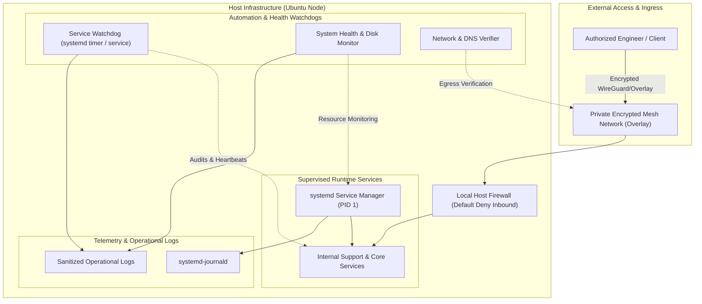
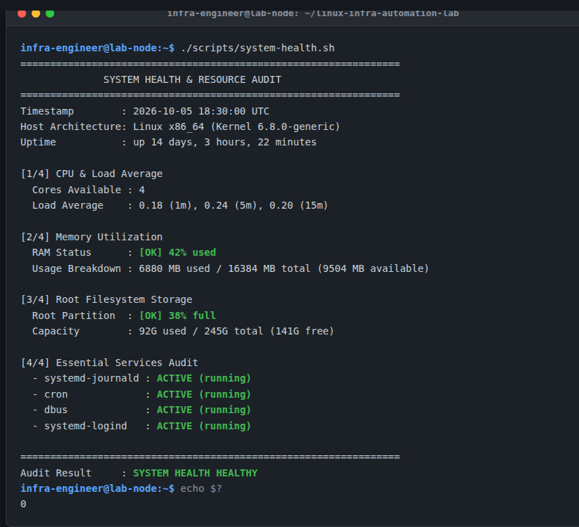
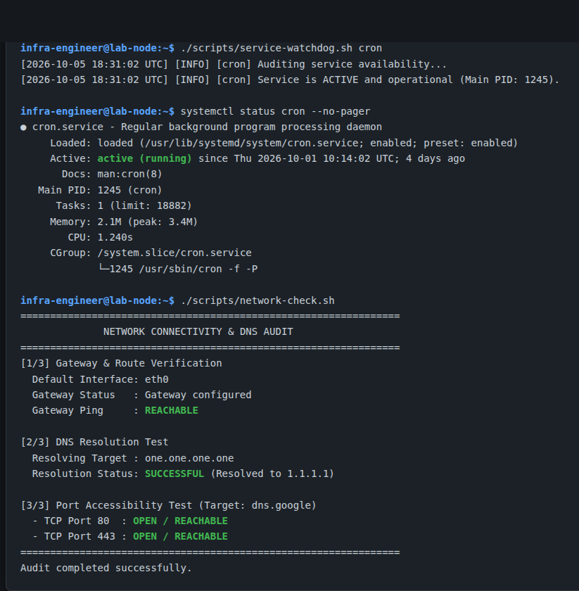

# Linux Infrastructure & Automation Lab

[](LICENSE)
[](https://ubuntu.com)
[](#)

A real-world, operational Linux infrastructure laboratory designed for hands-on **Tier 2 (N2) Technical Support**, **Systems Administration**, **Network Diagnostics**, and **Service Automation**.

This project documents the architectural foundations, operational runbooks, and automation scripts used to maintain reliable operational Linux workstation and server nodes, featuring zero-ingress network topology, systemd supervision, automated health audits, and structured incident response.

---

## Architecture Overview



For comprehensive details on architectural decisions and network design, see [docs/architecture.md](docs/architecture.md).

---

## Demonstrated Technical Competencies

- **Linux Systems Administration**: Deep understanding of `/proc`, `/sys`, memory metrics (buffers/cache vs. available), CPU load averages, and partition management.
- **Service Management (systemd)**: Writing custom unit files, timers, cgroups resource controls, sandboxing directives, and system lifecycle inspection.
- **Computer Networking (TCP/IP & DNS)**: Route inspection (`ip route`), socket diagnostics (`ss`), DNS resolution tracing, and port reachability analysis.
- **ITIL Incident Management & Troubleshooting**: Structured incident investigation following *Symptom → Diagnosis → RCA → Remediation → Verification*.
- **Infrastructure Automation (Bash & Python)**: Writing robust, operational automation scripts with strict error handling (`set -euo pipefail`), environment parameterization, and structured logging.
- **Security Hardening**: Implementation of the Principle of Least Privilege (PoLP), zero-trust private overlays, non-root daemons, and SSH hardening.

---

## Technologies in Active Use

| Layer | Technologies & Tools |
| :--- | :--- |
| **Operating System** | Ubuntu Linux / Debian-based distributions |
| **Service Supervision** | native systemd (PID 1), journald, systemd timers |
| **Scripting & Automation** | Bash (POSIX / modern), Python 3 |
| **Networking & Overlay** | Tailscale (WireGuard-based mesh), TCP/IP, DNS, DHCP, UFW / iptables |
| **Diagnostics & Telemetry** | `iproute2` (`ip`), `ss`, `df`, `free`, `ps`, `top`/`htop`, `dmesg`, `resolvectl` |
| **Browser CDP Engine** | Chromium DevTools Protocol (CDP) headless automation |
| **Version Control** | Git, GitHub |

> [!NOTE]
> Advanced Cloud/DevOps tools (Docker, Kubernetes, Terraform, AWS, Azure) are part of our forward evolution roadmap (see [Next Steps](#evolution-roadmap-cloud--devops)) and are intentionally not listed as core runtime dependencies here.

---

## Repository Structure

```text
linux-infra-automation-lab/
├── README.md                           # Master technical documentation
├── LICENSE                             # MIT License
├── .gitignore                          # Strict credential and artifact filtering
├── docs/
│   ├── architecture.md                 # Detailed sanitized network & system architecture
│   ├── troubleshooting.md              # N2 support incident playbooks (ITIL aligned)
│   ├── security.md                     # Hardening baseline and defensive engineering
│   └── screenshots/
│       ├── health-check-demo.png       # Live demonstration of system-health.sh
│       └── systemd-troubleshooting-demo.png # Demonstration of watchdog & network audit
├── scripts/
│   ├── system-health.sh                # System resources and service audit tool
│   ├── network-check.sh                # DNS, default gateway, and port verifier
│   └── service-watchdog.sh             # Supervised watchdog for critical services
├── systemd/
│   └── service-watchdog.service.example# Hardened systemd service unit example
└── examples/
    └── health-report.example.txt       # Sample sanitized execution output
```

---

## Automation Scripts Overview

### 1. System Health Audit (`scripts/system-health.sh`)
Monitors overall host health, memory pressure, storage thresholds, and verified states of essential services.
- **Features**: Alert thresholds for CPU (80%), RAM (85%), and Disk (90%); zero external dependencies; configurable monitored services via `SERVICES_LIST` environment variable.
- **Execution**:
  ```bash
  ./scripts/system-health.sh
  ```



### 2. Network & DNS Verifier (`scripts/network-check.sh`)
Validates Layer 3 reachability and Layer 7 DNS lookup without hardcoded internal IP addresses.
- **Features**: Automatic default route detection; parameterized target and ports; silent TCP handshake testing.
- **Execution**:
  ```bash
  ./scripts/network-check.sh [DNS_TEST_HOST] [TARGET_HOST] [COMMA_SEPARATED_PORTS]
  # Example:
  ./scripts/network-check.sh one.one.one.one dns.google "80,443"
  ```

### 3. Service Watchdog & Monitor (`scripts/service-watchdog.sh`)
Supervises background service health, writes UTC timestamped audit logs, and supports guarded auto-recovery.
- **Features**: Prevents dangerous restart loops by default; configurable log path; clean exit codes for integration into monitoring pipelines.
- **Execution**:
  ```bash
  ./scripts/service-watchdog.sh cron
  ```



---

## Support & Troubleshooting Scenarios (N2 Playbook)

Our operational playbooks cover three critical operational scenarios:

1. **Service Failure & Crash Loops**: Diagnosing exit codes, checking port conflicts (`ss -tulpn`), reviewing cgroup limits, and resolving runtime permissions.
2. **DNS & Network Degradation**: Identifying default gateway drops, diagnosing local stub resolver failures, and flushing caches.
3. **Runaway Process & Resource Leaks**: Triaging high CPU/RAM processes, analyzing OOM-killer logs, and terminating unresponsive tasks gracefully.

Detailed runbooks with step-by-step commands and verification criteria are documented in [docs/troubleshooting.md](docs/troubleshooting.md).

---

## Security & Hardening Baseline

This lab strictly adheres to corporate security standards:
- **Zero Exposed Ingress**: Inbound access is strictly limited to authenticated encrypted VPN mesh endpoints.
- **Hardened systemd Directives**: Daemons run under non-root users (`infra-service`) with `ProtectSystem=strict`, `ProtectHome=true`, and `NoNewPrivileges=true`.
- **Secret Sanitization**: No personal tokens, private IP ranges, or internal hostnames are committed.
- **Continuous Patching**: Operating system updates are audited regularly.

See [docs/security.md](docs/security.md) for full defensive engineering specifications.

---

## Evolution Roadmap (Cloud & DevOps)

- [ ] Containerize auxiliary monitoring utilities with lightweight Docker containers.
- [ ] Implement Infrastructure as Code (IaC) templates for automated node provisioning.
- [ ] Integrate Prometheus / Grafana telemetry exporters for time-series metrics.
- [ ] Connect hybrid cloud endpoints (AWS / Azure) via secure site-to-site VPN tunnels.

---

## Author & Contact

**Rafael do Nascimento Ribeiro**  
- **Location**: São José dos Campos, SP, Brazil  
- **Focus**: IT Support Analyst (N1/N2) · Infrastructure & Networks · Linux  
- **LinkedIn**: [linkedin.com/in/rafaeldnribeiro](https://www.linkedin.com/in/rafaeldnribeiro)  
- **GitHub**: [github.com/rafaeldnribeiro](https://github.com/rafaeldnribeiro)
