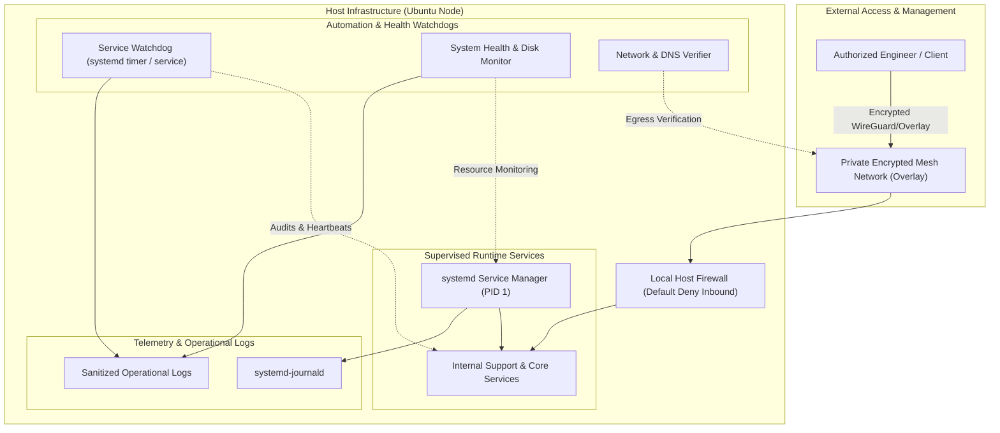

# Architecture Overview

This document details the architectural blueprint of the **Linux Infrastructure Automation Lab**. The design reflects modern corporate N2 support and site infrastructure practices, prioritizing zero public ingress, encrypted transport, and least-privilege automation.

---

## 1. High-Level Diagram

---

## 2. Core Architectural Pillars

### A. Zero Ingress Exposure
- Traditional server deployments often expose SSH (port 22) or web interfaces directly to public IP addresses, requiring constant vulnerability patching and mitigation against brute-force attacks.
- This laboratory utilizes an **encrypted overlay mesh VPN** based on modern cryptographic protocols.
- The host firewall enforces a strict **Default-Deny** policy for all unsolicited external inbound traffic, completely eliminating external port scanners and automated attacks.

### B. Service Supervision with systemd
- Linux services run under native **systemd supervision**, ensuring automated restart policies, dependency-ordered boot sequences (`After=network-online.target`), and process lifecycle isolation.
- Service units incorporate modern sandboxing directives:
  - `ProtectSystem=strict` (mounts `/usr`, `/boot`, `/etc` as read-only)
  - `ProtectHome=true` (denies access to `/home`)
  - `PrivateTmp=true` (isolates temporary directories)
  - `NoNewPrivileges=true` (prevents privilege escalation)

### C. Proactive Monitoring & Watchdogs
- Autonomous monitoring routines periodically assess resource consumption (CPU load averages, RAM exhaustion thresholds, and filesystem capacity).
- When a managed service becomes degraded or transitions to a failed state, the watchdog registers diagnostic snapshots, enabling rapid root cause analysis (RCA).

### D. Centralized Audit & Telemetry
- All automation scripts emit structured, timestamped logs formatted in standard UTC.
- Log aggregation decouples runtime reporting from interactive shell sessions, matching corporate enterprise operations standards.
